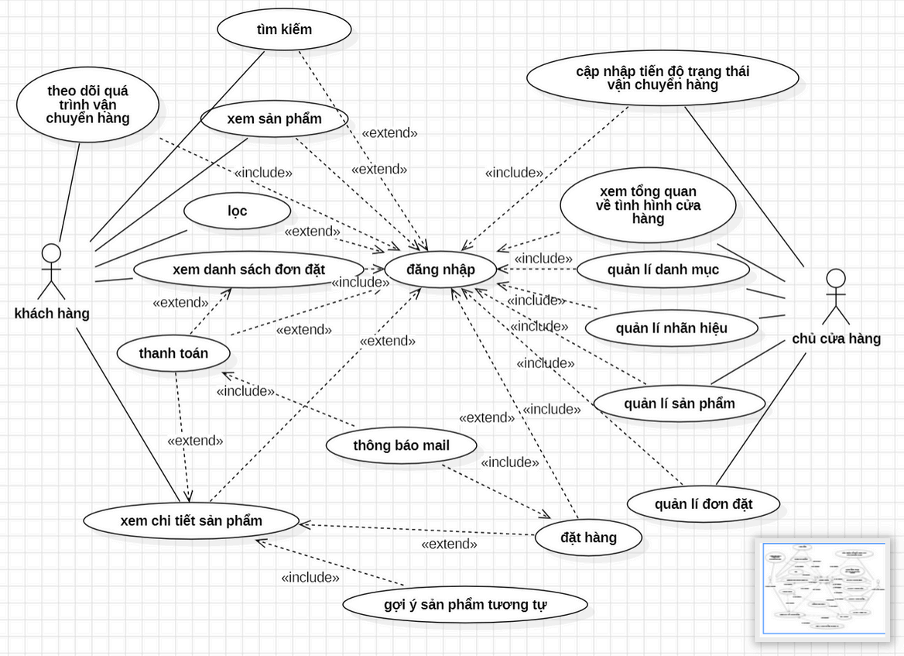

Vui lòng đọc giấy phép trước

University-Graduation-Project_Huy © 2024 by Bùi Quang Huy is licensed under CC BY-NC-ND 4.0 
Shield: [![CC BY-NC-ND 4.0][cc-by-nc-nd-shield]][cc-by-nc-nd]

This work is licensed under a
[Creative Commons Attribution-NonCommercial-NoDerivs 4.0 International License][cc-by-nc-nd].

[![CC BY-NC-ND 4.0][cc-by-nc-nd-image]][cc-by-nc-nd]

[cc-by-nc-nd]: http://creativecommons.org/licenses/by-nc-nd/4.0/
[cc-by-nc-nd-image]: https://licensebuttons.net/l/by-nc-nd/4.0/88x31.png
[cc-by-nc-nd-shield]: https://img.shields.io/badge/License-CC%20BY--NC--ND%204.0-lightgrey.svg


# I. Set up
change .env-example.local to .env.local fill all env value by your own
* MILVUS_DB_ADDRESS: milvus database use to connecting (example is ```localhost:19530``` if your run by docker-compose.yaml and not change it) or your own address
* MILVUS_URL: milvus database url using in docker-compose.yaml for web view database   
  * you can go to [http://localhost:8000](http://localhost:8000) when fill all value env to view (```default``` database and user and password is empty) after run docker compose
  * example value is [http://localhost:19530](http://localhost:19530) if your run by docker-compose.yaml and not change it
* MINIO_ACCESS_KEY: account to login minio aws s3  object storage (image,pdf,...) for milvus   
  * you can go to [http://localhost:9001](http://localhost:9001) when fill all value env to view after run docker compose

* MINIO_SECRET_KEY: password to login minio aws s3  object storage (image,pdf,...) for milvus 
  * you can go to [http://localhost:9001](http://localhost:9001) when fill all value env to view after run docker compose

* GOOGLE_CLIENT_ID: GOOGLE_CLIENT_ID get from [google console](https://console.cloud.google.com/) (Find out how to do it yourself create app and set auth....)
* GOOGLE_CLIENT_SECRET: GOOGLE_CLIENT_SECRET get from [google console](https://console.cloud.google.com/) (Find out how to do it yourself create app and set auth....)
* CALLBACK_URL: call back url google login 
  * example is: http://localhost:3000/api/auth/callback/google
  * you need add this to authorized Authorized redirect URIs in credenticall google (http://localhost:3000/api/auth/callback/google)
  * and Authorized JavaScript origins (http://localhost:3000)
* NEXTAUTH_SECRET: secrect string for security auth set what ever your want
* MONGODB_URI:  mongodb database use to connecting
* ADMIN_EMAIL: email who you want to administrator role (i set my email :v)
* NEXT_API_URL: base api url example is ```http://localhost:3000/api```
* CLOUDINARY_URL: url cloudiary save image, 3d model,... (Find out how to do it yourself create app and set auth....) [cloudinary console](https://console.cloudinary.com/) 
* CLOUDINARY_API_KEY: your CLOUDINARY_API_KEY (Find out how to do it yourself create app and set auth....) [cloudinary console](https://console.cloudinary.com/) 
* CLOUDINARY_API_SECRECT: your CLOUDINARY_API_SECRECT (Find out how to do it yourself create app....) [cloudinary console](https://console.cloudinary.com/) 
* CLOUDINARY_CLOUD_NAME: your CLOUDINARY_CLOUD_NAME (Find out how to do it yourself create app....) [cloudinary console](https://console.cloudinary.com/) 
  
* NEXTAUTH_URL: url access in browser example [http://localhost:3000](http://localhost:3000)
* 
* HUGGING_FACE_TOKEN: hugging face token use to call hugging face embedding vector model create your token and fill it (Find out how to do it yourself ...) [hugging face](https://huggingface.co/settings/tokens)
  * i used model ```all-MiniLM-L6-v2``` (apache-2.0 license) you can train your model and change it 

* NEXT_PUBLIC_STRIPE_PUBLISHABLE_KEY: public key stripe for payment you can get it in [stripe dashboard](https://dashboard.stripe.com/)
* STRIPE_SECRET_KEY: secret key stripe for payment you can get it in [stripe dashboard](https://dashboard.stripe.com/)
  
* RESEND_API_KEY=api key resend to send mail can get it in [resend](https://resend.com/api-keys)
# II. Run
* 1. milvusdb: from root folder run compose : ```docker compose up -d```
* 2. app from root folder run ```npm run dev```
  
# NOTE:
if you in develop and you can't login google by phone (because it can't access to local ip address) in desktop your can
  1. connect laptop (pc) and mobile same wifi 
  2. use nip.io to map dns laptop pc (set NEXTAUTH_URL like http://[ip address].nip.io:3000) replace "[ip address]" by ip get from ifconfig or ipconfig 
  3. set Authorized redirect URIs (http://[ip address].nip.io:3000/api/auth/callback/google) in credenticall google and Authorized JavaScript origins (nip.io)
if you release and have public domain it works normally ( set it in google console  and replace NEXTAUTH_URL )


# III. Use case, DB, Architecture
1. Use case  
  
2. DB  
   * Mongodb  
    
   * Milvus  
    
3. Architecture  
  
